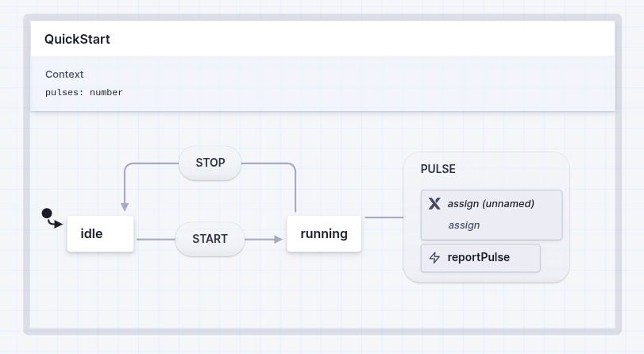

# XFSM

## Purpose

XFSM is an optional native hierarchical state-machine engine for Espruino. It
provides a compact, deterministic subset of XState-style statecharts for
embedded control applications while keeping the compiled machine structure
and execution coordinator in native C.

The initial supported feature set is called **Profile 1**. It covers machines
with one active state branch, including nested states, events, guards, actions,
context data, final states, and completion transitions. It is deliberately
smaller than the complete XState feature set: parallel states, delayed and
eventless transitions, invoked services, spawned actors, and history states
are not included.

Applications load the built-in module with `require("XFSM")`. The engine is
selected by adding `XFSM` to a board's `info.build.libraries` list, which makes
Espruino's board processing set `USE_XFSM=1` and include this directory's
wrapper and engine sources. The XFSM development workflow selects
`USE_XFSM=1` explicitly for continuous integration; it does not add XFSM to
any stock board definition.

## Current Implementation

The current implementation exposes `require("XFSM")` with working
`createMachine`, `assign`, and `createActor` entry points. `createMachine()`
validates the JavaScript definition and compiles it into a compact native
representation. `createActor()` creates an independent running instance with
its own current state, context, lifecycle, snapshots, and subscriptions;
multiple actors can share the same compiled machine.

The implemented behaviour includes nested state entry, hierarchical event
handling, guards, ordered actions and context assignments, wildcard events,
relative and ID-based transition targets, explicit state re-entry, final
states, completion transitions, stable snapshots, subscriptions, and
categorized configuration and runtime errors. Selected aliases are accepted
to ease migration from older XState machine definitions.

The detailed source of truth for supported syntax and behaviour is the
[Xstate-fsm-c Profile 1 specification](https://github.com/SimonGAndrews/XState-Espruino-Project/blob/main/projects/Xstate-fsm-c/docs/specification.md).

## Implementation Map

The implementation is split by responsibility:

- `jswrap_xfsm.c` defines the Espruino module surface and forwards calls into
  the engine.
- `xfsm_compile.c` validates JavaScript configuration and compiles it into an
  immutable machine data block plus its JavaScript functions and values.
- `xfsm_native.h` defines the compiled data format; `xfsm_native.c` checks its
  offsets, ranges, indexes, byte order, and padding before it is used.
- `xfsm_runtime.c` owns actor lifecycle, transition selection, ordered action
  execution, context publication, snapshots, and subscriptions.
- `xfsm_measure.c` and `xfsm_test.c` provide build-only resource measurement
  and deterministic fault injection. They are absent from the normal API.

The project documentation includes separate diagrams of
[memory ownership](https://github.com/SimonGAndrews/XState-Espruino-Project/blob/main/projects/Xstate-fsm-c/docs/memory-ownership.md)
and [memory lifetime](https://github.com/SimonGAndrews/XState-Espruino-Project/blob/main/projects/Xstate-fsm-c/docs/memory-lifetime.md).

### Compiler Flow

`createMachine()` checks the XState configuration and implementation options,
indexes the state hierarchy, resolves state targets, and collects the
JavaScript values that the machine must retain. A first pass counts the native
records and string bytes. A second pass writes them into one exact-sized
compiled data block. The machine object is returned only after that block has
passed the native-format checks; a failure releases all temporary values and
returns no partial machine.

### Actor Operation Flow

When `start()`, `send()`, or `stop()` has work to perform, it opens the actor and
its compiled machine data and marks the actor busy. The runtime then selects
and executes transitions using state indexes and bounded parent walks. Actions
and assignments run in their declared order, followed by completion transitions
where required. Once the operation is stable, the runtime makes the new state,
context, and snapshot visible and then calls subscribers. Action, guard,
context-factory, or runtime allocation failures during these operations put the
actor into its terminal error state.

## How to Exercise XFSM

This section is for developers building or verifying the library. Run these
commands from the root of the Espruino repository. Readers using firmware that
already includes XFSM can continue to the [Quick Start](#quick-start).

The existing Espruino Linux build produces the host executable `bin/espruino`,
which includes a `--test` option. This option loads and runs the named
JavaScript file inside that Espruino interpreter, then returns a process exit
status suitable for automated testing. These commands therefore exercise the
native XFSM implementation through its JavaScript API without requiring a
physical board.

### Linux JavaScript Test Suite

Build an XFSM-enabled Linux interpreter and run the JavaScript test suite with:

```bash
make clean
make USE_XFSM=1
bin/espruino --test libs/xfsm/tests/test_shell.js
bin/espruino --test libs/xfsm/tests/test_compile.js
bin/espruino --test libs/xfsm/tests/test_diagnostics.js
bin/espruino --test libs/xfsm/tests/test_runtime.js
bin/espruino --test libs/xfsm/tests/test_completion.js
bin/espruino --test libs/xfsm/tests/test_completion_cascade.js
bin/espruino --test libs/xfsm/tests/test_targets.js
bin/espruino --test libs/xfsm/tests/test_events_migration.js
bin/espruino --test libs/xfsm/tests/test_profile1_diagnostics.js
bin/espruino --test libs/xfsm/tests/test_context_ownership.js
bin/espruino --test libs/xfsm/tests/test_assign_forms.js
bin/espruino --test libs/xfsm/tests/test_context_diagnostics.js
bin/espruino --test libs/xfsm/tests/test_transition_domains.js
bin/espruino --test libs/xfsm/tests/test_transition_depth.js
bin/espruino --test libs/xfsm/tests/test_lifecycle_complete.js
bin/espruino --test libs/xfsm/tests/test_subscriber_complete.js
bin/espruino --test libs/xfsm/tests/test_cross_actor_gc.js
bin/espruino --test libs/xfsm/tests/test_runtime_errors.js
bin/espruino --test libs/xfsm/tests/test_subscriptions.js
bin/espruino --test libs/xfsm/tests/test_strict_validation.js
bin/espruino --test libs/xfsm/tests/test_strict_validation_embedded.js
bin/espruino --test libs/xfsm/tests/test_limits.js
```

`test_limits.js` creates event strings at the 65,535-byte boundary and is a
Linux-host test. Constrained targets exercise their applicable depth and
microstep boundaries with target-sized fixtures instead. The compact
`test_strict_validation_embedded.js` corpus is intended for constrained
physical targets whose JavaScript test heap cannot hold the full validation
suite and all of its source fixtures at once.

### Canonical Conformance Traces

Portable conformance cases use a versioned newline-delimited JSON trace. Each
record is printed as the operation is observed, so a physical target does not
need to retain the complete trace in RAM. The host runner composes the common
JavaScript harness with a case, runs it in the Linux Espruino interpreter, and
compares the resulting records with a reviewed baseline while ignoring object
property order:

```bash
python3 libs/xfsm/tests/run_trace_test.py \
  libs/xfsm/tests/trace_api_002.js \
  libs/xfsm/tests/expected/api_002.ndjson
python3 libs/xfsm/tests/run_trace_test.py \
  libs/xfsm/tests/trace_config_004.js \
  libs/xfsm/tests/expected/config_004.ndjson
python3 libs/xfsm/tests/run_trace_test.py \
  libs/xfsm/tests/trace_config_005.js \
  libs/xfsm/tests/expected/config_005.ndjson
python3 libs/xfsm/tests/run_trace_test.py \
  libs/xfsm/tests/trace_action_002.js \
  libs/xfsm/tests/expected/action_002.ndjson
python3 libs/xfsm/tests/run_trace_test.py \
  libs/xfsm/tests/trace_snapshot_002.js \
  libs/xfsm/tests/expected/snapshot_002.ndjson
python3 libs/xfsm/tests/run_trace_test.py \
  libs/xfsm/tests/trace_transition_005.js \
  libs/xfsm/tests/expected/transition_005.ndjson
python3 libs/xfsm/tests/run_trace_test.py \
  libs/xfsm/tests/trace_diagnostic_006.js \
  libs/xfsm/tests/expected/diagnostic_006.ndjson
python3 libs/xfsm/tests/run_trace_test.py \
  libs/xfsm/tests/trace_compat_006.js \
  libs/xfsm/tests/expected/compat_006.ndjson
python3 libs/xfsm/tests/run_trace_test.py \
  libs/xfsm/tests/trace_compat_006_v4.js \
  libs/xfsm/tests/expected/compat_006_v4.ndjson
```

The two `COMPAT-006` traces are generated independently by the pinned XState
5.33.2 and 4.38.3 reference models in the specification repository. They cover
shared statechart semantics and the retained v4 migration aliases respectively.

The runner never updates an accepted trace. A changed trace must be reviewed
and edited explicitly. To create the identical JavaScript artifact for the
paced physical-device runner, use:

```bash
python3 libs/xfsm/tests/run_trace_test.py \
  libs/xfsm/tests/trace_api_002.js \
  --compose-output /tmp/xfsm-api-002.js \
  --compose-done-marker
```

After the paced serial runner captures its output, compare the noisy transcript
with the accepted trace using `--observed-output <transcript>`. The comparator
extracts, validates and canonicalizes only `xfc.trace` records; transport and
REPL text are ignored.

### Allocation-Failure Tests

Deterministic allocation failures use a private test-only build. The
`XFSM._failNext(...)` method is available only when `XFC_TEST=1`; it is absent
from normal firmware and is not part of the public API.

```bash
make clean
make USE_XFSM=1 XFC_TEST=1
bin/espruino --test libs/xfsm/tests/test_fault_injection.js
```

Constrained physical targets may instead run
`test_fault_injection_embedded.js`. It covers representative compiler, actor,
startup, assignment, publication, snapshot, and subscription allocation seams
in sequential scopes so the test graph does not itself exhaust the target's
JsVar pool. The complete fault-seam matrix remains a Linux-host requirement.

### Whole-Interpreter Save And Reset Tests

`test_save_restore.js` and `test_reset_lifecycle.js` exercise Espruino's
device-specific whole-interpreter hibernation lifecycle. They are intentionally
excluded from the Linux and CI suite because the first test writes a saved
image, performs a hardware reboot, resumes through `E.on("init")`, and then
uses `reset(true)` to erase the image. Run them in that order with the paced
physical-device procedure documented by the Xstate-fsm-c project.

### Physical Application Integration Test

`test_host_application.js` is an original-ESP32 physical test and is not part
of the Linux suite. It exercises an application-shaped machine using an
outer-scope action, a retained closure, action and guard functions loaded from
Espruino `Storage`, a native guard, bound native GPIO actions, timer-driven
event ingress, subscriptions, and callback-fault rollback. It also removes its
temporary Storage module and leaves `LED1` low before reporting completion.

Run it with the paced physical-device procedure documented by the
Xstate-fsm-c project:

```text
libs/xfsm/tests/test_host_application.js
```

`test_host_memory_cleanup.js` repeatedly exercises shared machines, concurrent
actors, subscriptions, snapshots, garbage-collector relocation, ordinary
cleanup, repeated construction, and faulted-actor cleanup against a warmed
production-firmware memory baseline. `test_host_event_serialization.js`
confirms that a normally dispatched Espruino timer callback runs only after a
long synchronous sequence of actor sends has completed and published.

### ESP32-C3 Wireless-Service Coexistence Test

`prepare_host_service_coexistence.js` and
`test_host_service_coexistence.js` are physical ESP32-C3 fixtures. The first
compiles and starts an XFSM service coordinator containing a depth-24 branch;
the HTTPS-completion event traverses that branch and executes 49 ordered
entry, transition, and exit actions. The second keeps a BLE GATT connection
active while the C3 associates with WiFi and performs a TLS 1.2 HTTP request,
then verifies that XFSM reached its final state and BLE remained usable.

The service role is loaded from Espruino `Storage` by the external two-board
bench runner. This avoids retaining the large REPL input expression while the
already-compiled machine is live; it does not save the program or alter the
XFSM execution path. The runner erases its temporary Storage file during
cleanup. Bench configuration, credentials, the controlled HTTPS endpoint, and
the peer GATT role belong to the external ESP32 test bench rather than this
implementation repository.

### Resource Measurements

Flash, memory, stack, and execution-time measurements use a separate
instrumented build. The two private measurement methods in that build are
absent from normal firmware and are not part of the public API:

```bash
make clean
make USE_XFSM=1 XFC_MEASURE=1
bin/espruino --test libs/xfsm/tests/measure_m5.js
bin/espruino --test libs/xfsm/tests/measure_m5_completion.js
bin/espruino --test libs/xfsm/tests/measure_post_m6.js
bin/espruino --test libs/xfsm/tests/measure_post_m6_depth.js
bin/espruino --test libs/xfsm/tests/measure_compile_pressure.js
```

`measure_post_m6.js` uses a feature-rich Profile 1 fixture to report the
compiled arena, retained bindings, persistent machine and actor records,
snapshot and subscription costs, sampled runtime allocation peaks, coordinator
stack, and ESP32 heap state when available.
`measure_post_m6_depth.js` is a compact depth-32 harness used to distinguish
the engine's construction requirement from the JavaScript memory occupied by
larger all-in-one embedded test programs.
`measure_compile_pressure.js` adds actions to the depth-32 model and reports
compiler peak allocation and construction time for constrained-target checks.

### Stack Reserve Test

When `start()`, `send()`, or `stop()` is called, XFSM enters its native
**execution coordinator**. The coordinator performs event lookup, evaluates
guards, runs actions, follows the state hierarchy, and processes any completion
transitions until the actor reaches a stable state.

The temporary C stack space used while that work is in progress is referred to
as the **XFSM coordinator frame**. It holds the operation's working data, such
as the current event, active and pending state indexes, hierarchy traversal,
action progress, and completion-step count. This memory exists only for the
duration of the synchronous call; it is separate from the compiled machine and
the actor data retained between calls.

Before beginning an operation, XFSM checks that enough C stack space remains
for this work. The following deliberately oversized build verifies that an
operation is rejected safely when the required headroom is unavailable:

```bash
make clean
make USE_XFSM=1 XFC_STACK_RESERVE=2000000
bin/espruino --test libs/xfsm/tests/test_stack_reserve.js
```

Normal builds require 1024 bytes of available space on the processor's native C
call stack for the XFSM coordinator. This is the stack used while Espruino's
firmware C functions are executing, not the memory used to store JavaScript
variables or the machine's context. The requirement is in addition to
Espruino's 512-byte general C-stack safety allowance. If that space is
unavailable, the operation fails before changing the actor. A target may
override the private reserve at compile time by passing the optional Make
variable `XFC_STACK_RESERVE=<bytes>`. The Makefile converts this to the C
preprocessor definition `-DXFC_STACK_RESERVE=<bytes>` for the firmware build.
If the variable is omitted, XFSM uses the 1024-byte default. This is a private
build setting rather than a JavaScript or runtime option, and it should be
changed only after measuring the target's actual maximum stack use.

### Native-Format Sanitizer Suite

When application JavaScript calls `createMachine()`, XFSM validates and
compiles the supplied JavaScript machine configuration at runtime. The result
is a compact internal C memory representation called the **native format**.
Actors execute this compiled representation without repeatedly reading the
original configuration object.

The native-format test suite checks this low-level C representation directly,
independently of the Espruino JavaScript interpreter. It uses the host C
compiler with AddressSanitizer and UndefinedBehaviorSanitizer enabled so that
invalid memory access, memory leaks, and undefined C operations cause the test
to fail. From the repository root, run:

```bash
make -C libs/xfsm/tests/native clean test
```

The adjacent static-contract audit checks the production sources for the
portable and host-boundary invariants that are not usefully exercised by a
JavaScript scenario, including prohibited native allocation, recursion,
variable-length workspaces, mutable production globals, hidden ownership
names, private branding hooks, and generated-wrapper declarations:

```bash
python3 libs/xfsm/tests/audit_static_contract.py
```

The `-C libs/xfsm/tests/native` argument tells Make to run in the native-test
directory. The `clean` target removes the previous test build, and the `test`
target rebuilds the C test executable and runs it.

## Quick Start



This example models a device with `idle` and `running` states. `START` moves it
to `running`, `STOP` returns it to `idle`, and each `PULSE` event increments a
counter without changing state. The `reportPulse` action runs after the counter
has been updated.

With XFSM enabled in the firmware, define the machine, create an actor from it,
and start the actor before sending events:

```javascript
var XFSM = require("XFSM");
var assign = XFSM.assign;

var machine = XFSM.createMachine({
  id: "QuickStart",
  context: { pulses: 0 },
  initial: "idle",
  states: {
    idle: {
      on: {
        START: "running"
      }
    },
    running: {
      on: {
        PULSE: {
          actions: [
            assign({
              pulses: function (context, event) {
                return context.pulses + event.amount;
              }
            }),
            "reportPulse"
          ]
        },
        STOP: "idle"
      }
    }
  }
}, {
  actions: {
    reportPulse: function (context, event) {
      print("pulse", event.amount, "total", context.pulses);
    }
  }
});

var actor = XFSM.createActor(machine);

var subscription = actor.subscribe(function (snapshot) {
  print(snapshot.status, JSON.stringify(snapshot.value),
        JSON.stringify(snapshot.context));
});

actor.start();
actor.send("START");
actor.send({ type: "PULSE", amount: 2 });

var snapshot = actor.getSnapshot();
print(snapshot.matches("running")); // true

actor.send("STOP");
actor.stop();
subscription.unsubscribe();
```

The machine definition describes its states and transitions. Its `context`
holds application data, while `assign()` produces an action that updates that
data. Named action and guard functions are supplied in the second argument to
`createMachine()`.

`createMachine()` validates and compiles the definition once. Each
`createActor()` call then creates an independent execution of that machine.
`start()`, `send()`, and `stop()` run synchronously. `getSnapshot()` reports
the actor's stable state and context, and subscribed listeners are called only
after an operation has completed successfully.
